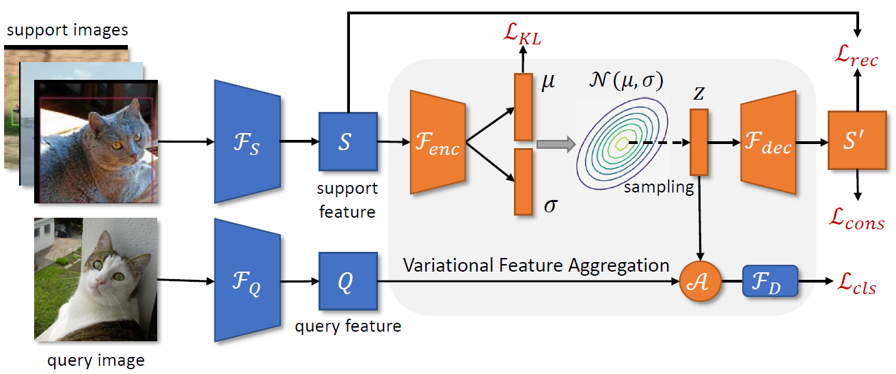

## VFA



> **Few-Shot Object Detection via Variational Feature Aggregation (AAAI2023)**<br>
> [Jiaming Han](https://csuhan.com), [Yuqiang Ren](https://github.com/Anymake), [Jian Ding](https://dingjiansw101.github.io), [Ke Yan](https://scholar.google.com.hk/citations?user=vWstgn0AAAAJ), [Gui-Song Xia](http://www.captain-whu.com/xia_En.html).<br>
> [arXiv preprint](https://arxiv.org/abs/2301.13411).

Our code is based on [mmfewshot](https://github.com/open-mmlab/mmfewshot).

### Setup

* **Installation**

Here is a from-scratch setup script.

```bash
conda create -n vfa python=3.8 -y
conda activate vfa

conda install pytorch==1.7.1 torchvision==0.8.2 cudatoolkit=11.0 -c pytorch

pip install openmim
mim install mmcv-full==1.3.12

# install mmclassification mmdetection
mim install mmcls==0.15.0
mim install mmdet==2.16.0

# install mmfewshot
mim install mmfewshot==0.1.0

# install VFA
python setup.py develop

```

* **Prepare Datasets**

Please refer to mmfewshot's [detection data preparation](https://github.com/open-mmlab/mmfewshot/blob/main/tools/data/README.md).


### Model Zoo

All pretrained models can be found at [github release](https://github.com/csuhan/VFA/releases/tag/v1.0.0).

#### Results on PASCAL VOC dataset

* **Base Training**

| Split | Base AP50 | config                                                                            | ckpt |
|-------|-----------|-----------------------------------------------------------------------------------|------|
| 1     | 78.6      | [config](configs/vfa/voc/vfa_split1/vfa_r101_c4_8xb4_voc-split1_base-training.py) | [ckpt](https://github.com/csuhan/VFA/releases/download/v1.0.0/vfa_r101_c4_8xb4_voc-split1_base-training_iter_18000.pth)    |
| 2     | 79.5      | [config](configs/vfa/voc/vfa_split2/vfa_r101_c4_8xb4_voc-split2_base-training.py) | [ckpt](https://github.com/csuhan/VFA/releases/download/v1.0.0/vfa_r101_c4_8xb4_voc-split2_base-training_iter_18000.pth)     |
| 3     | 79.8      | [config](configs/vfa/voc/vfa_split3/vfa_r101_c4_8xb4_voc-split3_base-training.py) | [ckpt](https://github.com/csuhan/VFA/releases/download/v1.0.0/vfa_r101_c4_8xb4_voc-split3_base-training_iter_18000.pth)     |

* **Few Shot Fine-tuning**

| Split | Shot | nAP50 | config                                                                                 | ckpt     |
|-------|------|-------|----------------------------------------------------------------------------------------|----------|
| 1     | 1    | 57.5  | [config](configs/vfa/voc/vfa_split1/vfa_r101_c4_8xb4_voc-split1_1shot-fine-tuning.py)  | [ckpt](https://github.com/csuhan/VFA/releases/download/v1.0.0/vfa_r101_c4_8xb4_voc-split1_1shot-fine-tuning_iter_400.pth)         |
| 1     | 2    | 65.0  | [config](configs/vfa/voc/vfa_split1/vfa_r101_c4_8xb4_voc-split1_2shot-fine-tuning.py)  | [ckpt](https://github.com/csuhan/VFA/releases/download/v1.0.0/vfa_r101_c4_8xb4_voc-split1_2shot-fine-tuning_iter_800.pth)         |
| 1     | 3    | 64.3  | [config](configs/vfa/voc/vfa_split1/vfa_r101_c4_8xb4_voc-split1_3shot-fine-tuning.py)  | [ckpt](https://github.com/csuhan/VFA/releases/download/v1.0.0/vfa_r101_c4_8xb4_voc-split1_3shot-fine-tuning_iter_1200.pth)         |
| 1     | 5    | 67.1  | [config](configs/vfa/voc/vfa_split1/vfa_r101_c4_8xb4_voc-split1_5shot-fine-tuning.py)  | [ckpt](https://github.com/csuhan/VFA/releases/download/v1.0.0/vfa_r101_c4_8xb4_voc-split1_5shot-fine-tuning_iter_1600.pth)         |
| 1     | 10   | 67.4  | [config](configs/vfa/voc/vfa_split1/vfa_r101_c4_8xb4_voc-split1_10shot-fine-tuning.py) | [ckpt](https://github.com/csuhan/VFA/releases/download/v1.0.0/vfa_r101_c4_8xb4_voc-split1_10shot-fine-tuning_iter_2000.pth)         |
| 2     | 1    | 40.8  | [config](configs/vfa/voc/vfa_split2/vfa_r101_c4_8xb4_voc-split2_1shot-fine-tuning.py)  | [ckpt](https://github.com/csuhan/VFA/releases/download/v1.0.0/vfa_r101_c4_8xb4_voc-split2_1shot-fine-tuning_iter_400.pth)         |
| 2     | 2    | 45.9  | [config](configs/vfa/voc/vfa_split2/vfa_r101_c4_8xb4_voc-split2_2shot-fine-tuning.py)  | [ckpt](https://github.com/csuhan/VFA/releases/download/v1.0.0/vfa_r101_c4_8xb4_voc-split2_2shot-fine-tuning_iter_800.pth)         |
| 2     | 3    | 51.1  | [config](configs/vfa/voc/vfa_split2/vfa_r101_c4_8xb4_voc-split2_3shot-fine-tuning.py)  | [ckpt](https://github.com/csuhan/VFA/releases/download/v1.0.0/vfa_r101_c4_8xb4_voc-split2_3shot-fine-tuning_iter_1200.pth)         |
| 2     | 5    | 51.8  | [config](configs/vfa/voc/vfa_split2/vfa_r101_c4_8xb4_voc-split2_5shot-fine-tuning.py)  | [ckpt](https://github.com/csuhan/VFA/releases/download/v1.0.0/vfa_r101_c4_8xb4_voc-split2_5shot-fine-tuning_iter_1600.pth)         |
| 2     | 10   | 51.8  | [config](configs/vfa/voc/vfa_split2/vfa_r101_c4_8xb4_voc-split2_10shot-fine-tuning.py) | [ckpt](https://github.com/csuhan/VFA/releases/download/v1.0.0/vfa_r101_c4_8xb4_voc-split2_10shot-fine-tuning_iter_2000.pth)         |
| 3     | 1    | 49.0  | [config](configs/vfa/voc/vfa_split3/vfa_r101_c4_8xb4_voc-split3_1shot-fine-tuning.py)  | [ckpt](https://github.com/csuhan/VFA/releases/download/v1.0.0/vfa_r101_c4_8xb4_voc-split3_1shot-fine-tuning_iter_400.pth)         |
| 3     | 2    | 54.9  | [config](configs/vfa/voc/vfa_split3/vfa_r101_c4_8xb4_voc-split3_2shot-fine-tuning.py)  | [ckpt](https://github.com/csuhan/VFA/releases/download/v1.0.0/vfa_r101_c4_8xb4_voc-split3_2shot-fine-tuning_iter_800.pth)         |
| 3     | 3    | 56.6  | [config](configs/vfa/voc/vfa_split3/vfa_r101_c4_8xb4_voc-split3_3shot-fine-tuning.py)  | [ckpt](https://github.com/csuhan/VFA/releases/download/v1.0.0/vfa_r101_c4_8xb4_voc-split3_3shot-fine-tuning_iter_1200.pth)         |
| 3     | 5    | 59.0  | [config](configs/vfa/voc/vfa_split3/vfa_r101_c4_8xb4_voc-split3_5shot-fine-tuning.py)  | [ckpt](https://github.com/csuhan/VFA/releases/download/v1.0.0/vfa_r101_c4_8xb4_voc-split3_5shot-fine-tuning_iter_1600.pth)         |
| 3     | 10   | 58.5  | [config](configs/vfa/voc/vfa_split3/vfa_r101_c4_8xb4_voc-split3_10shot-fine-tuning.py) | [ckpt](https://github.com/csuhan/VFA/releases/download/v1.0.0/vfa_r101_c4_8xb4_voc-split3_10shot-fine-tuning_iter_2000.pth)         |


#### Results on COCO dataset

* **Base Training**

| Base mAP | config                                                            | ckpt     |
|----------|-------------------------------------------------------------------|----------|
| 36.0     | [config](configs/vfa/coco/vfa_r101_c4_8xb4_coco_base-training.py) | [ckpt](https://github.com/csuhan/VFA/releases/download/v1.0.0/vfa_r101_c4_8xb4_coco_base-training_iter_110000.pth) |

* **Few Shot Finetuning**

| Shot | nAP  | config                                                                 | ckpt     |
|------|------|------------------------------------------------------------------------|----------|
| 10   | 16.8 | [config](configs/vfa/coco/vfa_r101_c4_8xb4_coco_10shot-fine-tuning.py) | [ckpt](https://github.com/csuhan/VFA/releases/download/v1.0.0/vfa_r101_c4_8xb4_coco_10shot-fine-tuning_iter_10000.pth) |
| 30   | 19.5 | [config](configs/vfa/coco/vfa_r101_c4_8xb4_coco_30shot-fine-tuning.py) | [ckpt](https://github.com/csuhan/VFA/releases/download/v1.0.0/vfa_r101_c4_8xb4_coco_30shot-fine-tuning_iter_20000.pth) |


### Train and Test

* **Testing**

```bash
# single-gpu test
python test.py ${CONFIG} ${CHECKPOINT} --eval mAP|bbox

# multi-gpus test
bash dist_test.sh ${CONFIG} ${CHECKPOINT} ${NUM_GPU} --eval mAP|bbox
```

For example:
* test VFA on VOC split1 1-shot with sinel-gpu, we should run:
```bash
python test.py configs/vfa/voc/vfa_split1/vfa_r101_c4_8xb4_voc-split1_1shot-fine-tuning.py \
work_dirs/vfa_r101_c4_8xb4_voc-split1_1shot-fine-tuning/iter_400.pth \
--eval mAP
```

* test VFA on COCO 10-shot with 8 gpus, we should run:
```bash
bash dist_test.sh configs/vfa/coco/vfa_r101_c4_8xb4_coco_10shot-fine-tuning.py \
work_dirs/vfa_r101_c4_8xb4_coco_10shot-fine-tuning/iter_10000.pth \
8 --eval bbox
```

* **Training**

```bash
# single-gpu training
python train.py ${CONFIG}

# multi-gpus training
bash dist_train.sh ${CONFIG} ${NUM_GPU}
```

For example: train VFA on VOC.
```bash
# Stage I: base training.
bash dist_train.sh configs/vfa/voc/vfa_split1/vfa_r101_c4_8xb4_voc-split{1,2,3}_base-training.py 8

# Stage II: few-shot fine-tuning on all splits and shots.
voc_config_dir=configs/vfa/voc/
for split in 1 2 3; do
    for shot in 1 2 3 5 10; do
        config_path=${voc_config_dir}/vfa_split${split}/vfa_r101_c4_8xb4_voc-split${split}_${shot}shot-fine-tuning.py
        echo $config_path
        bash dist_train.sh $config_path 8
    done
done
```

**Note**: All our configs and models are trained with 8 gpus. You need to change the learning rate or batch size if you use fewer/more gpus.


### Citation

If you find our work useful for your research, please consider citing:

```BibTeX
@InProceedings{han2023vfa,
    title     = {Few-Shot Object Detection via Variational Feature Aggregation},
    author    = {Han, Jiaming and Ren, Yuqiang and Ding, Jian and Yan, Ke and Xia, Gui-Song},
    booktitle = {Proceedings of the 37th AAAI Conference on Artificial Intelligence (AAAI-23)},
    year      = {2023}
}
```